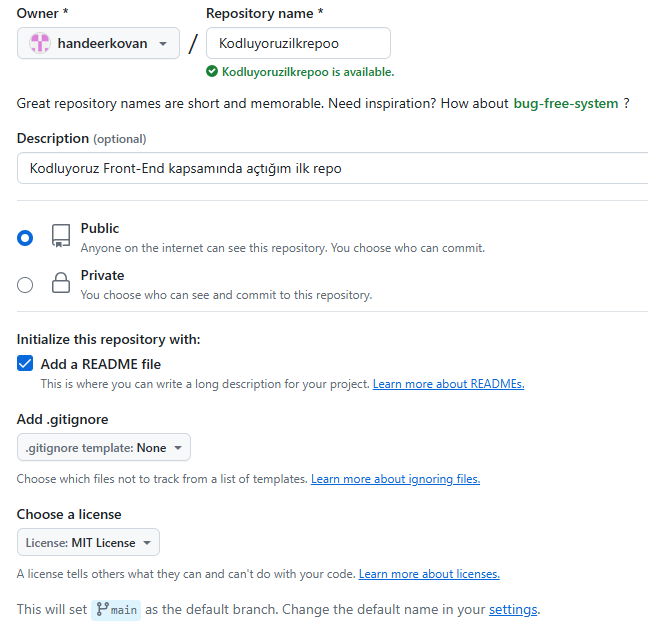

# Kodluyoruz İlk Repo
Bu repo [Kodluyoruz](https://www.kodluyoruz.org/
) Front-End Eğitiminde oluşturduğumuz ilk repo. İçerisinde bir adet README dosyası, bir adet de index.html barındırıyor.

# Installation
Öncelikle projeyi clonelayın.

    <clipboard-copy aria-label="Copy" class="ClipboardButton btn btn-invisible js-clipboard-copy m-2 p-0 d-flex flex-justify-center flex-items-center" data-copy-feedback="Copied!" data-tooltip-direction="w" value="git clone https://github.com/cengizcmataraci/kodluyoruzilkrepo.git" tabindex="0" role="button">
      <svg aria-hidden="true" height="16" viewBox="0 0 16 16" version="1.1" width="16" data-view-component="true" class="octicon octicon-copy js-clipboard-copy-icon">
    <path d="M0 6.75C0 5.784.784 5 1.75 5h1.5a.75.75 0 0 1 0 1.5h-1.5a.25.25 0 0 0-.25.25v7.5c0 .138.112.25.25.25h7.5a.25.25 0 0 0 .25-.25v-1.5a.75.75 0 0 1 1.5 0v1.5A1.75 1.75 0 0 1 9.25 16h-7.5A1.75 1.75 0 0 1 0 14.25Z"></path><path d="M5 1.75C5 .784 5.784 0 6.75 0h7.5C15.216 0 16 .784 16 1.75v7.5A1.75 1.75 0 0 1 14.25 11h-7.5A1.75 1.75 0 0 1 5 9.25Zm1.75-.25a.25.25 0 0 0-.25.25v7.5c0 .138.112.25.25.25h7.5a.25.25 0 0 0 .25-.25v-7.5a.25.25 0 0 0-.25-.25Z"></path>
 
<pre>git clone https://github.com/handeerkovan/kodluyoruzilkrepo.git</pre>

# Usage
Projeyi cloneladıktan sonra Visual Studio Code programında açınız.

Linux için:

    <clipboard-copy aria-label="Copy" class="ClipboardButton btn btn-invisible js-clipboard-copy m-2 p-0 d-flex flex-justify-center flex-items-center" data-copy-feedback="Copied!" data-tooltip-direction="w" value="cd kodluyoruzilkrepo
code ." tabindex="0" role="button">
      <svg aria-hidden="true" height="16" viewBox="0 0 16 16" version="1.1" width="16" data-view-component="true" class="octicon octicon-copy js-clipboard-copy-icon">
    <path d="M0 6.75C0 5.784.784 5 1.75 5h1.5a.75.75 0 0 1 0 1.5h-1.5a.25.25 0 0 0-.25.25v7.5c0 .138.112.25.25.25h7.5a.25.25 0 0 0 .25-.25v-1.5a.75.75 0 0 1 1.5 0v1.5A1.75 1.75 0 0 1 9.25 16h-7.5A1.75 1.75 0 0 1 0 14.25Z"></path><path d="M5 1.75C5 .784 5.784 0 6.75 0h7.5C15.216 0 16 .784 16 1.75v7.5A1.75 1.75 0 0 1 14.25 11h-7.5A1.75 1.75 0 0 1 5 9.25Zm1.75-.25a.25.25 0 0 0-.25.25v7.5c0 .138.112.25.25.25h7.5a.25.25 0 0 0 .25-.25v-7.5a.25.25 0 0 0-.25-.25Z"></path>
<pre>cd kodluyoruzilkrepo
code .</pre>

# Contributing
Pull requestler kabul edilir. Büyük değişiklikler için, lütfen önce neyi değiştirmek istediğinizi tartışmak için bir konu açınız.
# Licence
[MIT](https://choosealicense.com/licenses/mit/)
